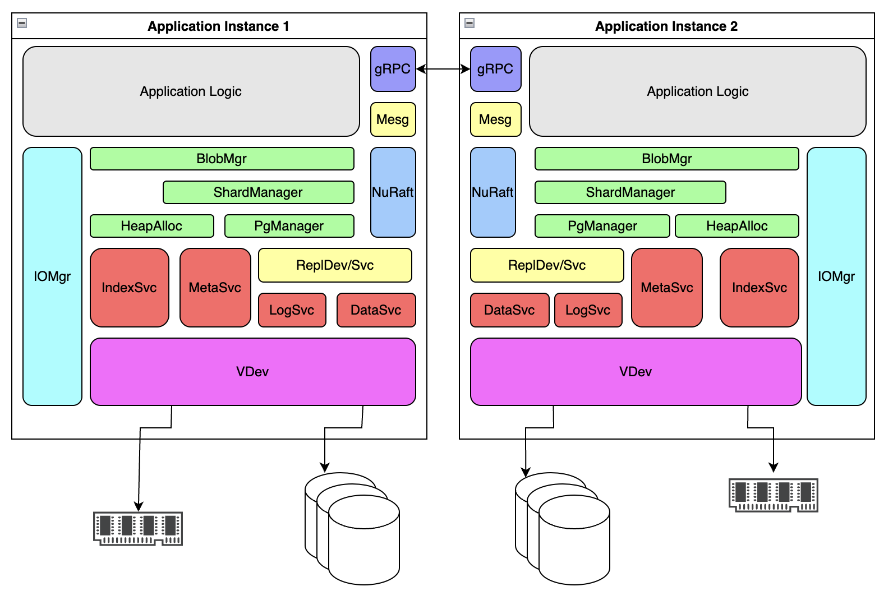

# HomeObject
[](https://github.com/eBay/homeobject/actions/workflows/conan_build.yml)
[](https://codecov.io/gh/eBay/HomeObject)

Replicated BLOB Store built upon [HomeStore](https://github.com/eBay/HomeStore).

## Terminology
HomeObject implements the management and persistence of three primary client visible “objects” that can be acted upon.

### BLOB (Binary Large Object)
A BLOB (or Blob) is an opaque set of bits of variable length. The contents of which are only consumed by the original
client application. This is the basic unit of storage made available Application. An identifier is returned as the
result of a Blob Put that the Application must use during retrieval in the future via a Blob Get operation.

A Blob *typically* represents a portion of a greater Named Object that is managed by the Application (e.g. an S3
gateway). Blobs are immutable (only deletion is allowed) and can not be moved between Shards.

[BlobManager API](https://github.com/eBay/HomeObject/blob/main/src/include/homeobject/blob_manager.hpp)

### Shard
A Shard represents a collection of Blobs; It is created up-front by the client and reserves a physical region of
storage. An identifier is returned as the result of Shard creation that is later used when writing addressing a Blob.

A Shard can be in two states, Open or Sealed. A Sealed Shard still maintains the Blobs written to it, but has returned
the physical region and its available capacity to the allocator and is forever Read Only. Shards enable better
allocation management and local grouping of related bucket writes as well as efficient garbage cleanup. It is possible
to move/copy a sealed Shard to another Pg for the purposes of capacity management or tiering.

[ShardManager API](https://github.com/eBay/HomeObject/blob/main/src/include/homeobject/shard_manager.hpp)

### Pg (Placement Group)
A Pg is an abstraction around the replication of a set of Shards. Pgs are maintained (replicated) along with all Shards
(and Blobs) they contain by a set of HomeObject instances. How these collections are formed is outside the concern of
HomeObject, but is used when addressing a particular Replicated Device (see Homestore Services).

Pgs can be remapped across instances of HomeObject for the purposes of load balancing or remediating a failure. The
management and scheduling of Pgs is the concern of the Application.

[PgManager API](https://github.com/eBay/HomeObject/blob/main/src/include/homeobject/pg_manager.hpp)

## Application Diagram



## Build

### System Pre-requisites
* CMake 3.13 or later
* conan 1.x (`pipx install conan~=1`)
* libaio-dev (assuming Ubuntu)
* uuid-dev (assuming Ubuntu)

### Dependencies
* SISL
```
$ git clone https://github.com/eBay/sisl
$ cd sisl & ./prepare.sh && conan export . oss/master
```

* IOManager
```
$ git clone https://github.com/eBay/iomanager
$ cd iomanager & ./prepare.sh && conan export . oss/master
```

* HomeStore
```
$ git clone https://github.com/eBay/homestore
$ cd homestore && conan export . oss/master
```

### Compilation
```
$ mkdir build
$ cd build

# Install all dependencies
$ conan install --build missing <path_to_homeobject>

# Build and Test
$ conan build <path_to_homeobject>
```

## Contributing to This Project
We welcome contributions. If you find any bugs, potential flaws and edge cases, improvements, new feature suggestions or
discussions, please submit issues or pull requests.

Contact
Brian Szmyd bszmyd@ebay.com

## License Information
Copyright 2023 eBay Inc.

Primary Author: Brian Szmyd

Primary Developers:
[Harihara Kadayam](https://github.com/hkadayam),
[Zichang Lai](https://github.com/zichanglai),
[Brian Szmyd](https://github.com/szmyd)

Licensed under the Apache License, Version 2.0 (the "License"); you may not use this file except in compliance with the
License. You may obtain a copy of the License at https://www.apache.org/licenses/LICENSE-2.0.

Unless required by applicable law or agreed to in writing, software distributed under the License is distributed on an
"AS IS" BASIS, WITHOUT WARRANTIES OR CONDITIONS OF ANY KIND, either express or implied. See the License for the specific
language governing permissions and limitations under the License.
